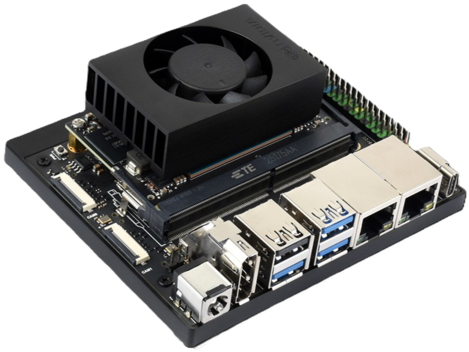

  

  # NVIDIA Jetson Orin Nano相關資源

建立此倉庫是為了解決與補足 **Jetson Orin Nano** 的不足之處，例如: 預設 Python 版本只有3.7、安裝 BNO055 Gyro Sensor 工具與程式庫等...

除此之外本倉庫提供了很多自動化腳本，如果覺得過程太過繁瑣可以使用本倉庫放在每一個章節開頭的一鍵配置指令，若是有興趣也可以下載來進行研究改編成自己的自動化腳本。

---